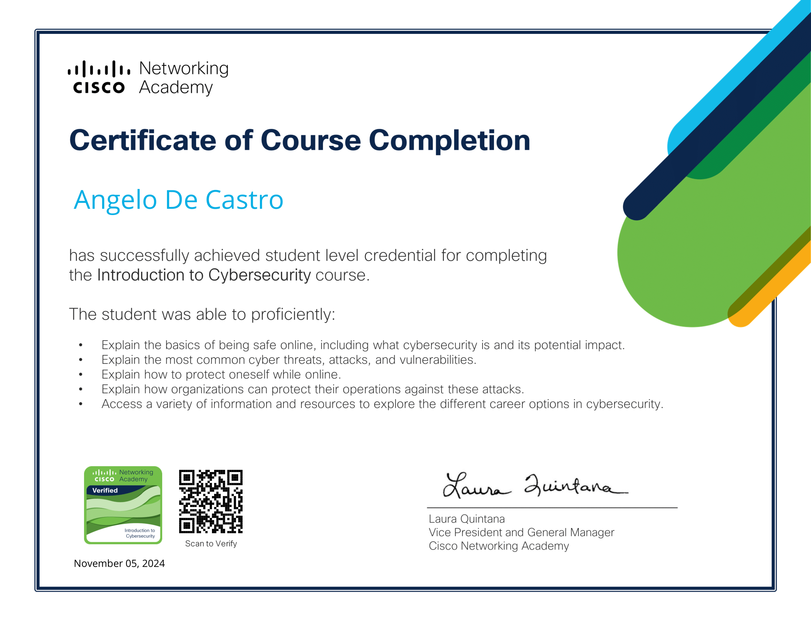

  

The Introduction to Cybersecurity, earning a verified credential that highlights my foundational understanding of cybersecurity principles. This includes knowledge of global cyber threats, best practices, network vulnerabilities, and data privacy. The course also introduced key concepts in threat detection and defense, reinforcing my commitment to pursuing advanced cybersecurity certifications.

  