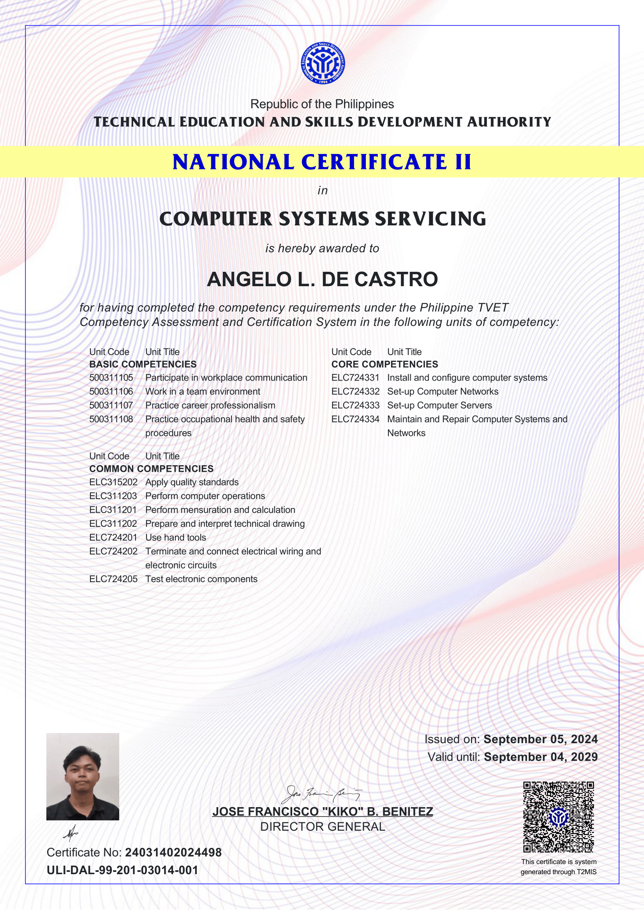

  

I hold a National Certificate II in Computer Systems Servicing from TESDA, validating my skills in installing and configuring computer systems, setting up networks and servers, and performing maintenance and repairs. This certification reflects my technical proficiency and commitment to quality and safety standards.

  