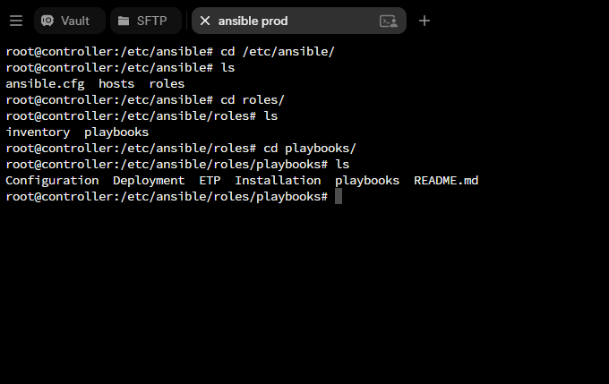

# Navigating Ansible Roles and Playbooks

    

This is the directory structure where I store all my Ansible automation scripts for easy setup and deployment of services across each branch.

---
  

# Ansible Playbook for Docker

    

This is one of the automation tools I developed to simplify the installation of essential resources on the ETP branch server. Using Ansible, it automates the entire setup process from dependency installation to repository configuration ensuring consistent, efficient deployment across production environments. By eliminating repetitive manual steps, this playbook enables faster, cleaner, and more reliable provisioning.

  