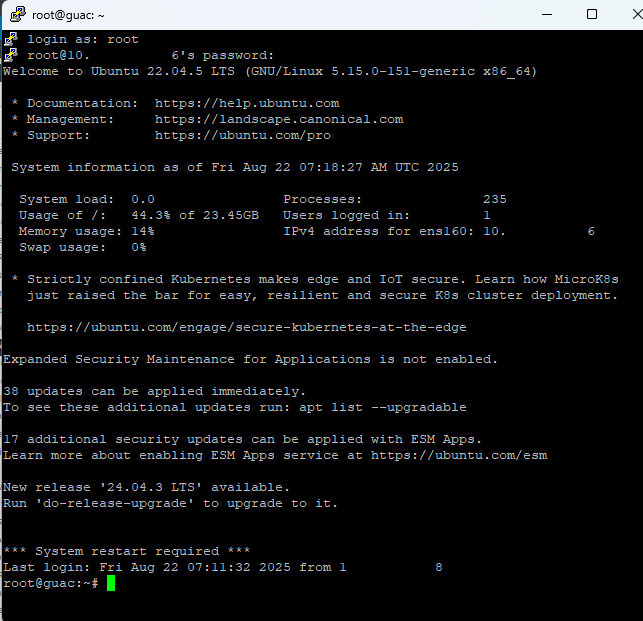

 
  

  Guacamole is a clientless remote desktop gateway that supports protocols like VNC, RDP, and SSH. This project showcases the deployment of Apache Guacamole using Docker Compose, with integrated LDAP authentication and SSL encryption.

