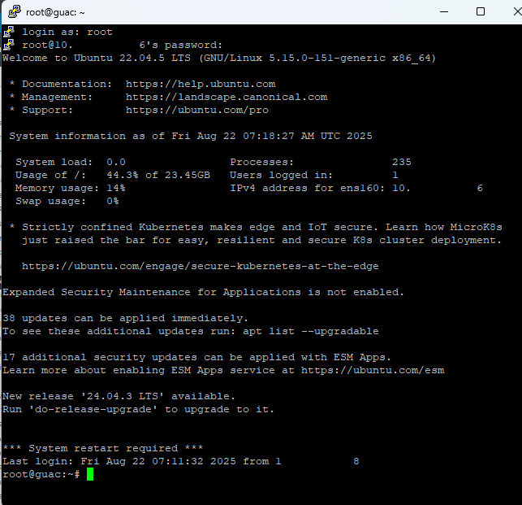
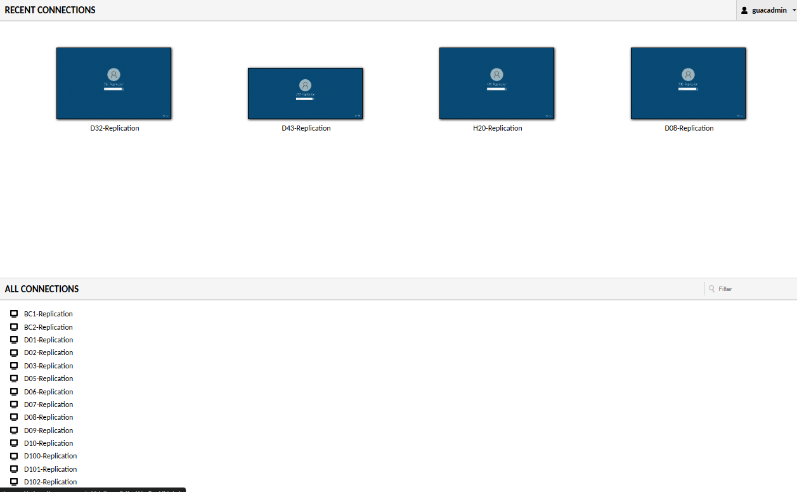
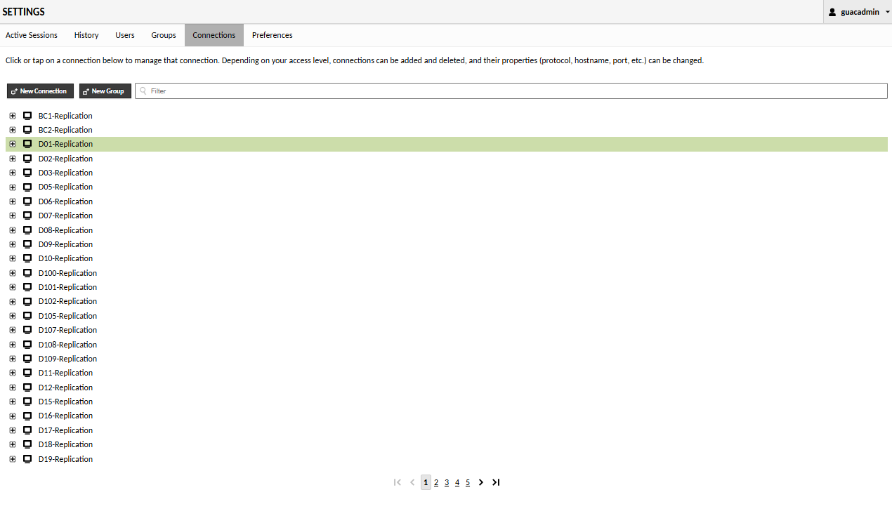

# Guacamole Server
 

    

---
  

# Guacamole Dashboard

   

This is the Guacamole dashboard I maintain for remote access to replicated branch systems. As guacadmin, I manage access, naming, and grouping for scalability.

---
  

# Connections 

   

Using Apache Guacamole, you can easily create and manage multiple remote connections through a centralized web interface.

  