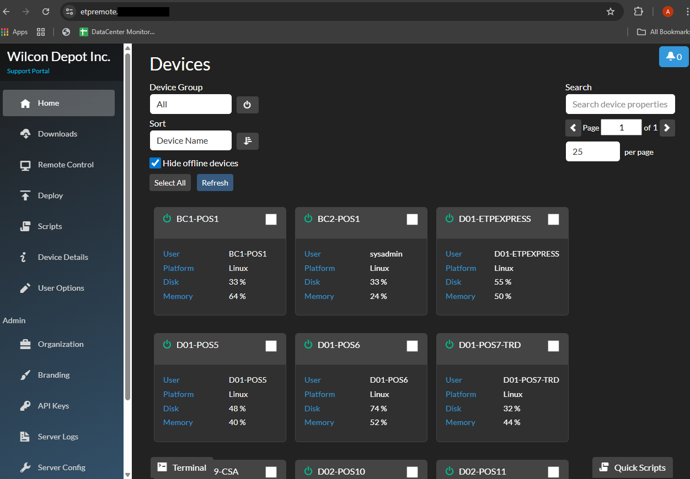
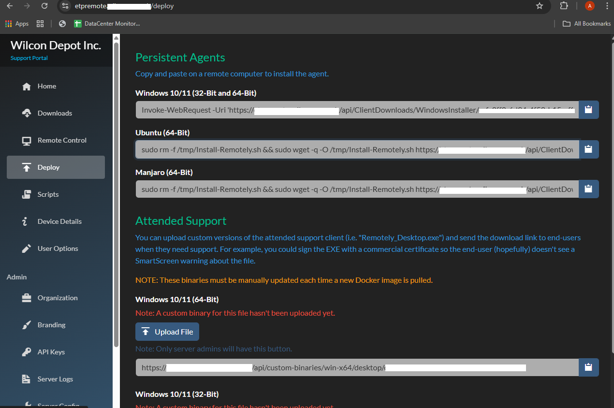

# Remotely Docker Containers

    

This shows my Docker setup for Remotely and Caddy, running as containers with persistent health checks and exposed ports for secure remote access.

---

  

# Remotely Dashboard

    

On this dashboard, Remotely tracks user, platform, disk, and memory usage to help monitor devices and manage performance proactively.

---

  

# Remotely Deploy Agent

    

This section provides remote deployment commands for persistent agents across Windows, Ubuntu, and Manjaro, enabling secure and scalable remote support.

  